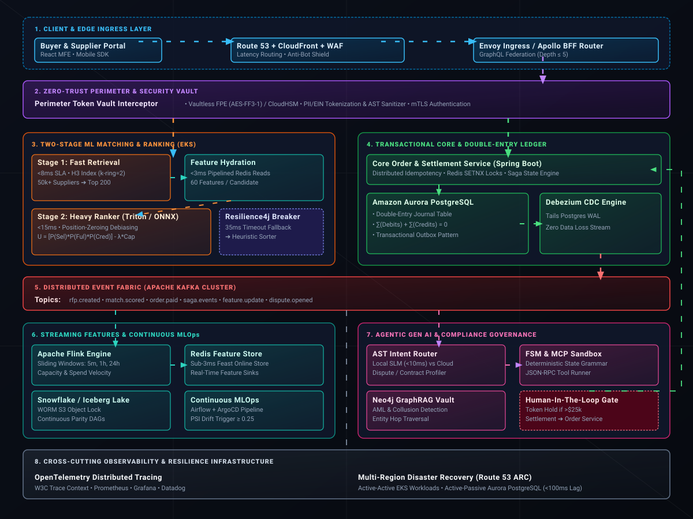

# 🌐 ApexMinerals Mesh, AI Platform

**Artificial Intelligence (AI) Zero-Trust Agentic Supply Chain Intelligence for Critical Minerals**

[](https://www.python.org/downloads/)
[](https://nextjs.org/)
[](https://neo4j.com/)
[](https://opensource.org/licenses/MIT)

ApexMinerals Mesh is an enterprise-grade, open-source AI architecture designed to secure, audit, and transparently map the global rare earth and critical minerals supply chain. Built to support the **2026 US-India Initiative on Critical and Emerging Technology (iCET)** and the **Minerals Security Partnership (MSP)**.

This platform utilizes a **Zero-Trust Agentic Mesh**, **Deterministic FSM Runtimes**, and a **TaskRabbit-inspired Learning-to-Rank (LTR) ML Engine** to dynamically route defense procurement away from high-risk shadow ports and toward compliant, allied refineries.
## 🌐 Enterprise AI/ML Distributed Architecture 

<p align="center">
  
</p>

## 🚀 Core Architecture & Features

### 1. 🔒 Zero-Trust Data Clean Room (ITAR/CUI Compliant)
Defense contractors cannot send proprietary alloy specs or supplier IDs to public LLMs. The `TokenVault` intercepts prompts, encrypts sensitive entities via AES-256, and replaces them with surrogate tokens (e.g., `[SUPPLIER_0]`) before LLM inference, rehydrating them locally upon return.

### 2. 🧠 Multi-Factor ML Ranking & Debiasing Engine
Inspired by Staff-level ML ranking paradigms, the platform uses an **XGBoost Regressor** to score suppliers based on:
* **Geopolitical Risk & ITAR Compliance**
* **Shadow Trade Debiasing:** Penalizes transshipment hubs (e.g., Vietnam, Malaysia) that mask Chinese-origin minerals.
* **ESG & Green Refining Optimization:** Calculates carbon-intensity scores based on grid vs. solar/hydro processing.

### 3. 🕸️ Agentic GraphRAG via Model Context Protocol (MCP)
LLMs are isolated from direct database access. Agents query a local **Neo4j Supply Chain Graph** via strict JSON-RPC MCP tool endpoints to trace multi-hop ownership structures (Mine ➔ Refinery ➔ Middleman ➔ Defense OEM).

### 4. ⏸️ HITL Governance & A2A Protocol
* **Anti-Amplification Supervisor:** Blocks Agent-to-Agent (A2A) handoffs if confidence scores drop below 0.85.
* **Async Suspension:** If a sanction risk is detected, the FSM hard-pauses, serializes state memory to SQLite, and fires a webhook for Human-in-the-Loop (HITL) approval before resuming.

### 5. 📜 Cryptographic Observability & Policy Simulator
Every millisecond of execution is hashed into an immutable OpenTelemetry trace log for SEC/DoD auditability. The **Deterministic Replay Simulator** allows analysts to inject "What-If" geopolitical shocks (e.g., *China Export Ban*) and watch the ML engine dynamically reroute the graph.

---

## 🖥️ The Command Center UI

The frontend is a production-ready **Next.js 14** application featuring a dark-mode Defense Command Center.
* **Interactive React Flow Canvas:** Visualizes the Neo4j graph with animated nodes and edges.
* **Live Clean Room Auditor:** Side-by-side visual proof of local token encryption.
* **Real-Time ML Injection:** Click "Run Policy Simulator" to watch XGBoost scores update graph nodes instantly.

---

## 🛠️ Tech Stack

* **Frontend:** Next.js 14 (App Router), Tailwind CSS, Shadcn UI, React Flow (`@xyflow/react`)
* **Backend API:** Python FastAPI, Uvicorn
* **AI / ML:** Scikit-Learn, XGBoost, Sentence-Transformers (Semantic Cache), Ollama (Local SLMs)
* **Databases:** Neo4j (Graph), SQLite (Token Vault & State Memory)
* **Infrastructure:** Docker, Apple Silicon Metal Acceleration (M-Series optimized)

---

## ⚡ Quickstart (Run Locally for $0)

This entire platform is optimized to run 100% locally on an Apple Silicon Mac (M-Series) with unified memory.

### 1. Start the Neo4j Graph Database
```bash
docker run -d --name neo4j-apexminerals -p 7474:7474 -p 7687:7687 -e NEO4J_AUTH=neo4j/password123 neo4j:latest
